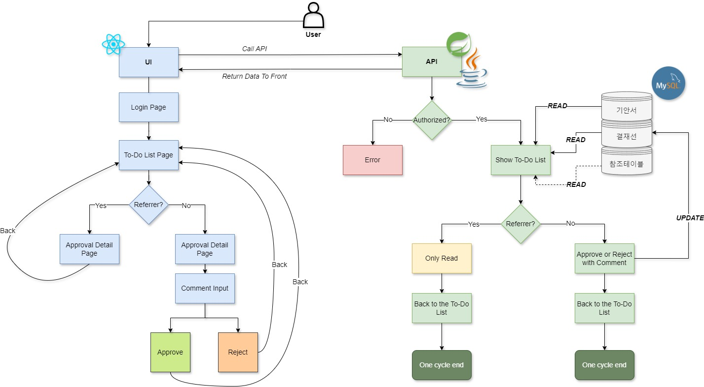

# 결재시스템 -> 품의 요청 #

본 프로젝트에서 품의 요청 관리 시스템의 **일부**를 구현하였습니다.

하기 2 파트로 나눠서 정리해보겠습니다.

1. BACKEND -> API
2. FRONTEND -> WEBPAGE

***전체 다이어그램:***


## Database 부분 ##

### 1.1 DB, 테이블 생성 ###
테이블 **3개** 생성
- DB 테이블 설계 기반으로
- 미션1에서 **결재정보, 결재선정보, 결재첨부파일정보** 3개의 테이블 생성 및 사용
- 각 column 속성 확인
  - null 여부
  - PRIMARY KEY
  - size 등 설계서 기반
```
CREATE SCHEMA ApprovalSystem;
USE ApprovalSystem;
CREATE TABLE APPR_INF(
APPR_ID BIGINT NOT NULL AUTO_INCREMENT PRIMARY KEY,
TASK_DIV VARCHAR(5),
APPR_TYP VARCHAR(5),
TITL VARCHAR(200),
CNTNT_TYP VARCHAR(1),
CNTNT VARCHAR(3000),
APPR_LN_CHG_PSBL_YN VARCHAR(1),
CALLBACK_URL VARCHAR(3000),
FRST_REG_USER_ID VARCHAR(5),
FRST_REG_DTMT DATETIME,
LAST_CHG_USER_ID VARCHAR(5),
LAST_CHG_DTMT DATETIME);

CREATE TABLE APPR_LN_INF(
APPR_LN_ID BIGINT NOT NULL AUTO_INCREMENT PRIMARY KEY,
APPR_LN_SRNO BIGINT NOT NULL,
APPR_DIV VARCHAR(1),
USER_ID VARCHAR(5),
APPR_PROC VARCHAR(1),
APPR_PROC_DTMT DATETIME,
CMNT VARCHAR(1000),
APPR_ID BIGINT,
APPR_LN_TMPT_ID BIGINT,
FRST_REG_USER_ID VARCHAR(5),
FRST_REG_DTMT DATETIME,
LAST_CHG_USER_ID VARCHAR(5),
LAST_CHG_DTMT DATETIME);

CREATE TABLE APPR_ATCHD_FILE_INF(
APPR_ATCHD_FILE_ID BIGINT NOT NULL AUTO_INCREMENT PRIMARY KEY,
APPR_ATCHD_FILE_SRNO BIGINT NOT NULL,
FILE_ID BIGINT NOT NULL,
FILE_NM VARCHAR(200),
FILE_PATH VARCHAR(1000),
APPR_ID BIGINT,
FRST_REG_USER_ID VARCHAR(5),
FRST_REG_DTMT DATETIME,
LAST_CHG_USER_ID VARCHAR(5),
LAST_CHG_DTMT DATETIME);
```

### 1.2 Foreign Key ###
🗝️ 이번 프로잭트에서 ***사용 안했지만***, 지정 및 조회에 대해 정리해봅니다.

*`APPR_ID`를 foreign key로 지정:*
```
ALTER TABLE APPR_LN_INF
ADD FOREIGN KEY (APPR_ID) REFERENCES APPR_INF(APPR_ID);

ALTER TABLE APPR_ATCHD_FILE_INF
ADD FOREIGN KEY (APPR_ID) REFERENCES APPR_INF(APPR_ID);
```

*foreign key 조회 및 삭제:*

*조회*
```
SELECT
    CONSTRAINT_NAME,
    TABLE_NAME,
    COLUMN_NAME,
    REFERENCED_TABLE_NAME,
    REFERENCED_COLUMN_NAME
FROM
    INFORMATION_SCHEMA.KEY_COLUMN_USAGE
WHERE
    CONSTRAINT_SCHEMA = 'approvalsystem'
    AND REFERENCED_TABLE_NAME IS NOT NULL;
```

*삭제*
```
ALTER TABLE appr_atchd_file_inf
DROP FOREIGN KEY appr_atchd_file_inf_ibfk_1;

ALTER TABLE appr_ln_inf
DROP FOREIGN KEY appr_ln_inf_ibfk_1;
```

*테스트 시, 테이블 클리어*
```
TRUNCATE TABLE APPR_INF;
TRUNCATE TABLE APPR_LN_INF;
TRUNCATE TABLE APPR_ATCHD_FILE_INF;
```

### 2. API 부분 ###

### 2.0 개발 환경 ###

- 언어: JAVA 21
- 프레임워크: Spring Boot 3.3.1
- 프로젝트 빌드도구: Gradle - Groovy
- IDE: IntelliJ IDEA
- 데이터베이스: MySQL
- REST API Documentation 툴: Swagger UI
- OS: Windows

### 2.1 Domain ###

- 3 tables -> 3 domain files
- 각 테이블 column 기준으로 변수 선언
- 각 변수 속성 디테일 주의

Domain 부분에서 특별히 어려운 것 없지만, **database와 똑같이 initialize**해야 되는 점 중요합니다.

동시에 각 column에 맞게 어노테이션 적용.

예를 들어,

```
@Data
@NoArgsConstructor
@AllArgsConstructor
@Entity
@Table(name = "appr_inf")

public class ApprInf {
    @Id
    @GeneratedValue(strategy = GenerationType.IDENTITY)
    @Column(name = "APPR_ID", nullable = false)
    private Long apprId;
...
...
```
에서 `APPR_ID ` column은 ID고, null 불가, 데이터 길이 제한 따로 없습니다.


### 2.2 DTO ###

데이터 전송: DTO는 데이터 전송 시 사용되며, 대부분 Domain 객체를 기준으로 구현됩니다.

❗*주의 1*❗ **여러 개**의 객체를 받을 경우: 다수의 데이터를 처리할 때는 List를 사용하여 관리합니다.

`ApprDto.java` 파일의 일부 참고:

```
    private List<ApprLnInfDto> apprLnInfDto;
    private List<ApprAtchdFileInfDto> apprAtchdFileInfDto;
```


❗*주의 2*❗ 처음에 dto에서 시간 찍었습니다. (최초 등록 시간 초기화 할 때 `LocalDateTime.now()`사용해서 dto에서 현재 시간 찍음)

하지만 이게 정말 불필요하고 뒤로 갈수록 문제가 될 수 있습니다. 앞으로 결재선 각 승인구분 처리자가 품의서 처리 시, 그 때의 '마지막 수정 시간' 기록해야 되는데, dto에서 초기회된 시간이 존재하는 것 이상합니다.

1. `private LocalDateTime frstRegDtmt;  private LocalDateTime lastChgDtmt;` 시작부타 `LocalDateTime.now()`로 초기화하면, 앞으로 나타나는 모든 시간 다 초기화됨. 분명히 처리하지 않았는데? null로 표시해야 되는데 이상한 시간으로 찍혀있었네? 문제 발생! :(
2. 앞으로 각 결재선 처리 후, 그때그때 시간 기록하는 것 제일 쉽고 정확한 접근방식입니다.

DTO는 데이터 전송 시 사용 되는 **entity로**, 나중에 많이 사용하게 됩니다.

따라서, entity에서 어떤 항목들 넣어야 되는지 잘 고려해야 합니다.


### 2.3 Service ###

Interface  `ApprService`, implement `ApprServiceimpl` 2개의 파일로 관리

Service layer는 아마 시간 투자 제일 많이 필요한 영역입니다.

여기서 각 client<->database 데이터 전송하는 기능 구현합니다.

이 부분에서도 엄청 어려운 것 없습니다. 어려운 것 보다 디테일 부분!

❗*주의 1*❗ 예를 들어, `ApprLnInf _apprLnInf = apprLnInfRepository.save(apprLnInf);`에서 `save`한 번하면 entity로 한 번 저장합니다.

따라서, save는 마지막에서 딱 한 번으로 정리하는 것 좋습니다.

❗*주의 2*❗ 한 entity에서 또 하나의 entity 받을 때, loop 헷갈리지 않게 돌림.


### 2.4 Repository ###

❗ 이 번 프로젝트에서 ***nativeQuery의 사용*** 중요합니다!
```
@Query(value = "순수 쿼리문", nativeQuery = true)
String methodName(Long ...); // method
```

MySQL에서 코드 다 쓰고 ide로 복붙하는 것 추천합니다. 변수는 :(메소드에서 실제로 받은 변수)로 바꾸면 끝 🤓

📝여기서 쿼리 쓸 때 대해 중요한 사상(?) 하나 있습니다 => _MAX(), MIN() 활용!_

설명보다 코드로 보시죠:

```
/*
    버그 기록: 단순히 +1 쓰면 한 단계가 없어지면 애러뜸
    예: A>B>C>D 승인 단계로 가면 아무 문제 없고, A>B>D로 가면 애러
    수정 후: 현 APPR_DIV 보다 큰 DIV 중 MIN subquery 찾으면 됨
    @Query(value = "SELECT USER_ID\n" +
            "FROM APPR_LN_INF\n" +
            "WHERE APPR_LN_INF.APPR_ID = :apprId\n" +
            "AND APPR_LN_INF.APPR_PROC is null\n" +
            "AND APPR_LN_INF.APPR_DIV = CHAR(ASCII(:apprDiv)+1)", nativeQuery = true)
 */
    @Query(value = "SELECT USER_ID FROM APPR_LN_INF\n" +
            "WHERE APPR_ID = :apprId\n" +
            "AND APPR_PROC is null\n" +
            "AND APPR_DIV = (\n" +
            "SELECT MIN(APPR_DIV) FROM APPR_LN_INF\n" +
            "WHERE APPR_ID = :apprId\n" +
            "AND APPR_PROC is null\n" +
            "AND APPR_DIV > :apprDiv)", nativeQuery = true)
    List<String> nextUserNoDuplicate(Long apprId, String apprDiv);
```


### 2.5 Controller ###

1. 예외처리 빠짐없이 처리
2. Format
   - try {...}
   - catch exception
   - return something


### 3. BACKEND 마지막 정리 ###

이 번 리포트 쓰면서 느낀 점은 전(?) 보다 확실히 이해도가 많이 높아졌습니다.

문구가 많지 않지만, 주의해야 할 점 / 개발 어려운 포인트 위주로 기록하였습니다.

둥시에 1차 프로젝트 비해서 내가 뭘 했는지, 왜 그렇게 했는지, 현재 또 뭘 쓰고 있는지 잘 알고 있습니다.

얍!


## UI 부분 ##

### 1. 개발 환경 ###

- 언어: JavaScript, HTML, CSS
- 프레임워크: React
- IDE: Visual Studio Code
- 패키지 매니저: npm 10.8.2
- OS: Windows

### 2. 설치 및 세팅 ###

프론트 본격적으로 시작하기 전에 제 예상 어려운 점은 연동 & data fetch 였는데 ***실제로 설치 및 세팅 부분에 이상한 small issues 진짜 많았습니다.***

조금 바보 같이 보일 수 있지만 최대하 상세하게 기록해보겠습니다.

### 2.1 Set Up ###

1. Download node.js from https://nodejs.org/en
2. Here comes the problem. The terminal kept telling me cannot find `roaming\npm`
```
npm error path C:\Users\Administrator\AppData\Roaming\npm
```
하지만 해당 경로 가서 보니까 폴더 이미 존재합니다.

***Solution:***

1. cd to the current project > src > main
2. run this
```
npm install -g npm
```
3. Create React App
```
npx create-react-app ui-name-you-want
```
4. Done!

### 2.2 Spring Boot + React.js 개발환경 연동 (본 프로젝트 기준) ###

❗ 주의해야 할 점 먼저 정리하자면, 이런 영역(?) 문법 자주 변경되는 점!

***Sol 1***: src>main>front-end-folder>src> create a new file 'setupProxy.js'
```
const {createProxyMiddleware} = require('http-proxy-middleware');
module.exports = function(app){
  app.use(
    createProxyMiddleware({
      target: 'http://localhost:8080',
      changeOrigin: true,
      pathFilter: '/api',
    }),
  );
};
```

처음에 계속 에러 났는데 찾아보니까 http-proxy-middleware > pathFilter 속성값 지정해줘야 합니다.

참고: https://www.npmjs.com/package/http-proxy-middleware

***Sol 2***: Add
```
 "proxy": "http://localhost:8080",
```
in package.json

이제 http://localhost:3000/ 가도 자연스럽게 백엔드와 연동되어있음 (구현해야..)

### 2.3 구현 > hooks ###

사실 이 부분에 크게 어려운 것 없습니다. (?)과연

하지만 사소한 디테일들 제일 어렵죠.. 프론트 특

그래서 여기서 구현 자체 기록하는 것 보다 ***제 노트***처럼 써볼게요ㅋㅋ

⚠️중국어 주의

🎶***Note Time: useEffect*** 

useEffect 是 React 中的一个 Hook，用于处理副作用（side effects），比如数据获取、订阅、手动操作 DOM 等。它接受两个参数：

第一个参数：一个函数，包含副作用的逻辑。

第二个参数：一个数组（dependencies），用于指定副作用的依赖项。


_-依赖数组的作用-_

当依赖数组为空（[]）时，useEffect 中的函数只在组件首次渲染时执行一次。

当依赖数组中包含某些变量时，只有当这些变量发生变化时，useEffect 中的函数才会被调用。

如果不提供依赖数组，useEffect 中的函数将在每次渲染后执行。


_-例子-_

以下是几个例子，展示不同依赖数组的用法：

1. 空依赖数组
```
import React, { useEffect } from 'react';

function Example() {
  useEffect(() => {
    console.log('组件首次渲染时执行');
  }, []); // 只在组件首次渲染时执行一次

  return <h1>你好，世界！</h1>;
}
```
在这个例子中，useEffect 中的代码只会在组件首次渲染时执行一次。

2. 依赖数组中有变量
```
import React, { useState, useEffect } from 'react';

function Counter() {
  const [count, setCount] = useState(0);

  useEffect(() => {
    console.log(`当前计数: ${count}`);
  }, [count]); // 只有当 count 变化时才会执行

  return (
    <div>
      <p>当前计数: {count}</p>
      <button onClick={() => setCount(count + 1)}>增加计数</button>
    </div>
  );
}
```
在这个例子中，useEffect 的依赖数组中包含了 count 变量。只有当 count 的值发生变化时，useEffect 中的函数才会执行，从而输出当前计数。

3. 没有依赖数组
```
import React, { useState, useEffect } from 'react';

function Example() {
  const [value, setValue] = useState(0);

  useEffect(() => {
    console.log('每次渲染时都会执行这个副作用');
  }); // 没有依赖数组，每次渲染都会执行

  return (
    <div>
      <p>当前值: {value}</p>
      <button onClick={() => setValue(value + 1)}>增加值</button>
    </div>
  );
}
```

在这个例子中，由于没有依赖数组，useEffect 中的函数会在每次组件渲染时执行，无论 value 是否变化。

_-总结-_

依赖数组允许你控制副作用的执行时机。

使用依赖数组可以优化性能，避免不必要的副作用调用。

理解何时使用空数组、包含依赖项或不使用数组，将有助于编写高效的 React 组件。

🎶***Note Time: useNavigate***

Maybe one of the easiest hooks
```
import { useNavigate } from 'react-router-dom';
const navigate = useNavigate();
navigate('/');
```
But the point here is: ***DO NOT USE `useHistory`***, the grammer has been changed!!

### 2.4 HTML ###

(우선 html 무시하지 말자 ^^)

대부분 구현 거의 다 완성했을 때 갑자기 이상한 문제가 생겼습니다.

페이지가 중간부터 로딩됩니다.

처음에 margin/padding/height 등에만 집중했는데 다 원인이 아니었어여.. 시간도 많이 낭비했고...

결국 찾은 해결법은 `align-items: flex-start;` 한 줄만 추가하면 끝입니다. 👼
```
body, html {
    font-family: Arial, sans-serif;
    height: 100%;
    margin: 0;
    padding: 0;
    display: flex;
    justify-content: center;
    align-items: flex-start; /* 여기요!!!!!!!!!!!!!!!!!! */
}
```
### 3. FRONTEND 마지막 정리 ###

1. 각 component 관리가 중요합니다.
2. component 간 변수 전달 / hook의 사용 / axios의 사용 (아래 import)

```
import React, { Component, useEffect } from "react";
import { useParams, useNavigate } from 'react-router-dom';
import { useState } from "react";
import axios from "axios";
```
